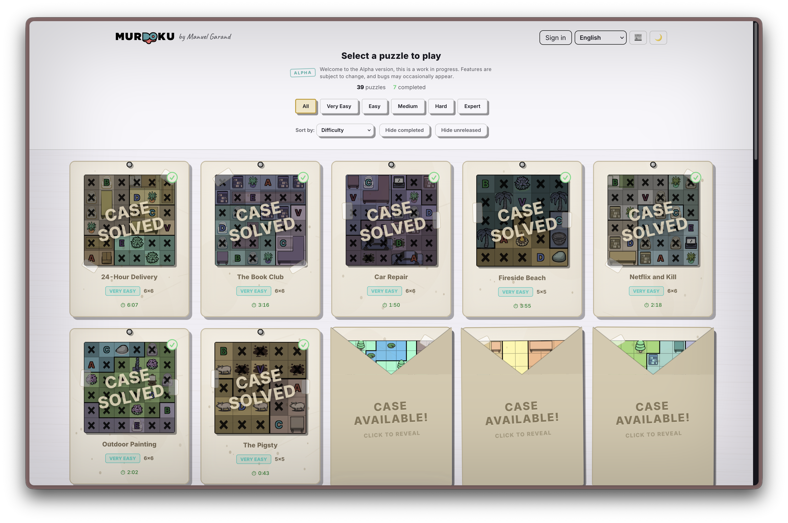
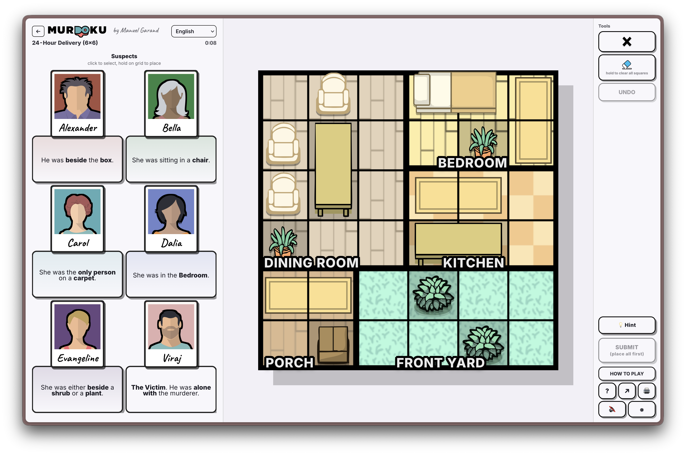

# Murdoku Solver

An SMT-based constraint solver for [Murdoku](https://murdoku.com/play), the popular logic puzzle game where **Sudoku meets murder mystery** (created by Manuel Garand).



> [!NOTE]
> **Work in Progress**: This project is under active development. More puzzle clues, constraints, and solver operations are currently being added.
>
> *Disclaimer*: This is purely a fun personal exploration and is not intended to take away from the satisfaction of solving Murdoku puzzles by hand—the real magic is in the deduction!

---

## What is Murdoku?

In **Murdoku**, you are a detective investigating a crime scene laid out on a 2D grid. By reading witness statements and circumstantial clues, you must deduce the exact location of every suspect and the victim to crack the case.

## How it Works

`murdoku-solver` translates the board layout, room boundaries, impassable cells, rook distinctness, and natural language clues into first-order logic constraints evaluated by Microsoft's [Z3 SMT solver](https://github.com/Z3Prover/z3). If a unique or valid configuration exists, the solver returns the exact coordinates for every character.

---

## Installation

Ensure you have Python 3.10+ installed. Clone this repository and install it in editable mode:

```bash
# Clone the repository
git clone https://github.com/martineberlein/murdoku-solver.git
cd murdoku-solver

# Create and activate a virtual environment
python3 -m venv .venv
source .venv/bin/activate

# Install dependencies and package
pip install -e .
```

---

## Example Walkthrough: 24-Hour Delivery (6×6)

Below is a complete, step-by-step walkthrough modeling and solving the first Murdoku case: **24-Hour Delivery**.

<p align="center">
  
</p>

You can run this case directly:

```bash
python cases/24-hour-delivery/solve.py
```

### Step 1: Define Rooms and Board Layout

The crime scene is a 6×6 grid partitioned into 5 distinct rooms:

```python
from murdoku_solver import BoardLayout

layout = BoardLayout(width=6, height=6)

# Define room bounding cells
layout.add_room("DiningRoom", [(r, c) for r in range(4) for c in range(3)])
layout.add_room("Bedroom", [(r, c) for r in range(2) for c in range(3, 6)])
layout.add_room("Kitchen", [(r, c) for r in range(2, 4) for c in range(3, 6)])
layout.add_room("Porch", [(r, c) for r in range(4, 6) for c in range(2)])
layout.add_room("FrontYard", [(r, c) for r in range(4, 6) for c in range(2, 6)])
```

### Step 2: Add Objects and Obstacles

Objects can be **passable** (characters can stand on them, like chairs and rugs) or **impassable** (obstacles blocking the square, like tables, beds, and shrubs):

```python
# Passable furniture & decor
layout.add_object("DiningChairHead", "chair", [(0, 1)], passable=True)
layout.add_object("DiningChairLeft1", "chair", [(1, 0)], passable=True)
layout.add_object("DiningChairLeft2", "chair", [(2, 0)], passable=True)
layout.add_object("PorchChair", "chair", [(5, 1)], passable=True)

layout.add_object("BedroomCarpet", "carpet", [(0, 5), (1, 5)], passable=True)
layout.add_object("KitchenCarpet", "carpet", [(2, 3), (2, 4)], passable=True)
layout.add_object("PorchCarpet", "carpet", [(4, 1)], passable=True)

# Impassable obstacles
layout.add_object("DiningTable", "table", [(1, 1), (2, 1)], passable=False)
layout.add_object("Bed", "bed", [(0, 3), (0, 4)], passable=False)
layout.add_object("KitchenCounter", "table", [(3, 3), (3, 4)], passable=False)

layout.add_object("DiningPlant", "plant", [(3, 0)], passable=False)
layout.add_object("BedroomPlant", "plant", [(1, 4)], passable=False)
layout.add_object("YardShrub1", "shrub", [(4, 3)], passable=False)
layout.add_object("YardShrub2", "shrub", [(5, 4)], passable=False)

layout.add_object("DeliveryBox", "box", [(4, 0)], passable=False)
```

### Step 3: Define the Characters

Every person on the board is either a suspect or the victim:

```python
from murdoku_solver import Person

people = [
    Person("Alexander"),
    Person("Bella"),
    Person("Carol"),
    Person("Dalia"),
    Person("Evangeline"),
    Person("Viraj", is_victim=True),
]
```

### Step 4: Translate the In-Game Clues

Each statement from the case sheet translates directly into a solver constraint:

```python
from murdoku_solver import (
    AloneWithVictim,
    BesideCategory,
    InRoom,
    OnCategory,
    OnlyPersonOnCategory,
)

clues = [
    BesideCategory("Alexander", "box"),              # "He was beside the box."
    OnCategory("Bella", "chair"),                    # "She was sitting in a chair."
    OnlyPersonOnCategory("Carol", "carpet"),         # "She was the only person on a carpet."
    InRoom("Dalia", "Bedroom"),                      # "She was in the Bedroom."
    BesideCategory("Evangeline", ["shrub", "plant"]), # "She was either beside a shrub or a plant."
    AloneWithVictim("Viraj"),                        # "The Victim. He was alone with the murderer."
]
```

### Step 5: Solve and Format Output

```python
from murdoku_solver import MurdokuEngine, SolutionPrinter

engine = MurdokuEngine(layout, people, clues)
solution = engine.solve()

printer = SolutionPrinter(layout, people)
printer.print_solution(solution, title="Case: 24-Hour Delivery (6x6)")
```

### Output

```text
=== Case: 24-Hour Delivery (6x6) ===
Solution found:
  Alexander  (Suspect): Row 5, Col 0
  Bella      (Suspect): Row 0, Col 1
  Carol      (Suspect): Row 2, Col 4
  Dalia      (Suspect): Row 1, Col 3
  Evangeline (Suspect): Row 4, Col 2
  Viraj      (Victim ): Row 3, Col 5

Grid (R0-R5 top to bottom, C0-C5 left to right):
   C0 C1 C2 C3 C4 C5
R0  .  B  .  .  .  . 
R1  .  .  .  D  .  . 
R2  .  .  .  .  C  . 
R3  .  .  .  .  .  V 
R4  .  .  E  .  .  . 
R5  A  .  .  .  .  . 

Victim Viraj was in the Kitchen.
The murderer alone with Viraj was: Carol!
```

---

- Official Murdoku Game: [murdoku.com/play](https://murdoku.com/play)
- Z3 Theorem Prover: [github.com/Z3Prover/z3](https://github.com/Z3Prover/z3)
